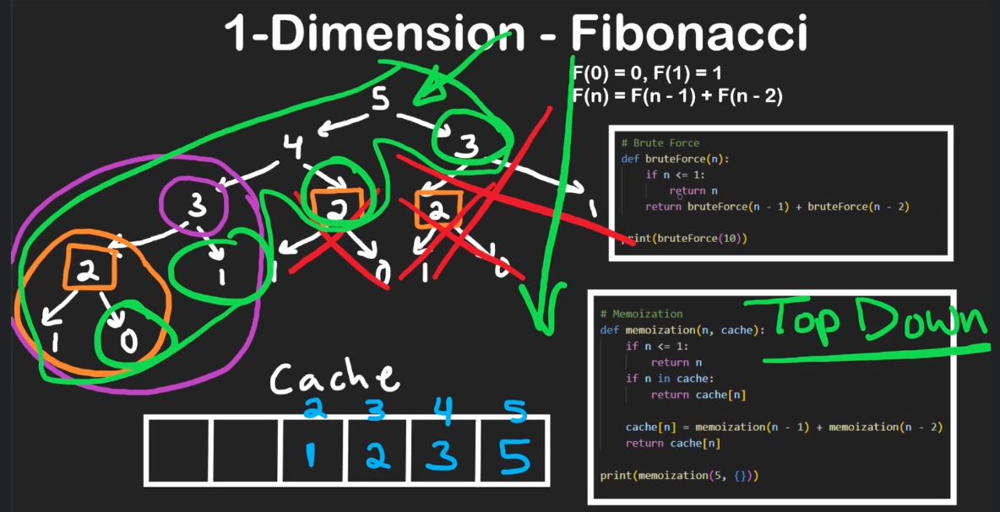
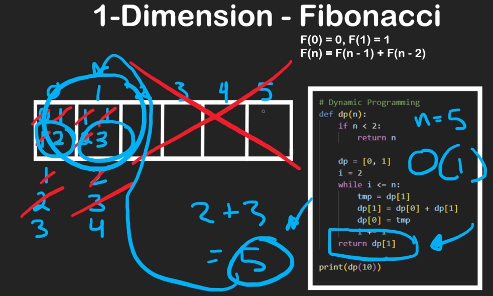
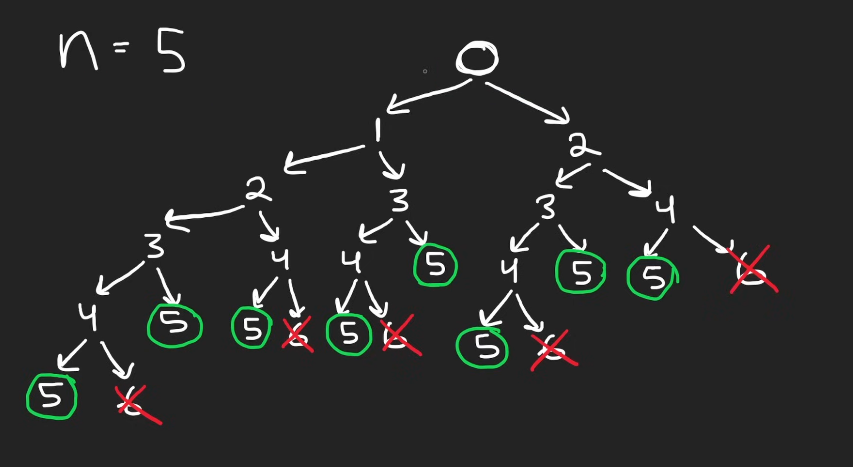
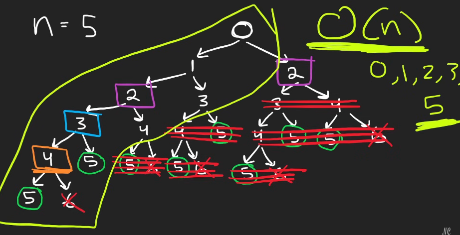
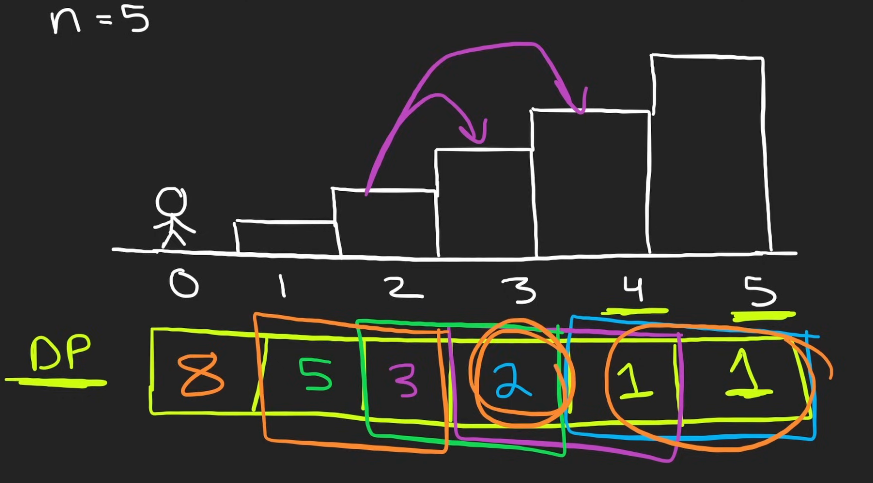
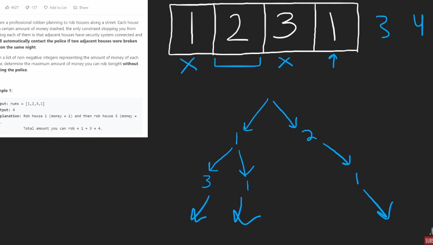
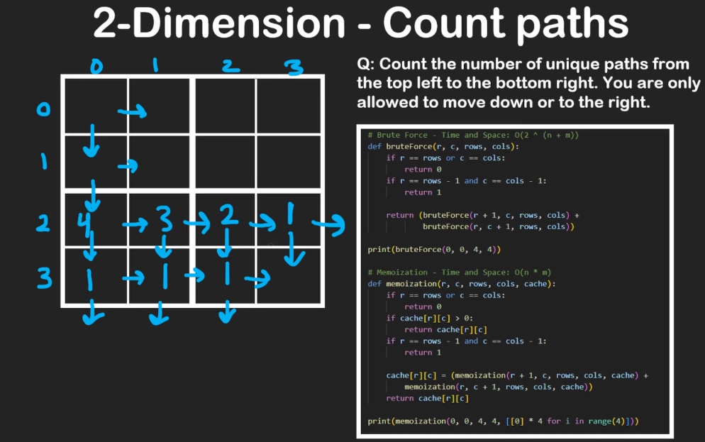
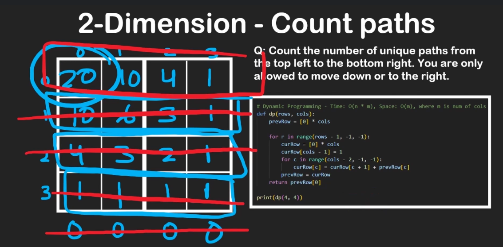
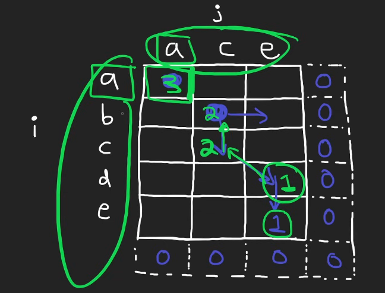

# Algorithms and Data Structures for Beginners (25h)

## Arrays

## Linked Lists

## Recursion

## Binary Search

## Trees

## Backtracking

## Heap/Priority Queue

## Hashing

## Graphs

## Dynamic Programming

### 1-Dimension DP -- Fibonacci

- F(0) = 0; F(1) = 1; F(n) = F(n-1) + F(n-2)
- use loop to find f(n) -- O(n)
- 
- memoization --- store results in cache that you plan on reusing. (no need to store basecase results) 
  - top-down
  - root of the tree to base case
- tabluation 
  - bottom - up
  - compute result of base case and work upwards
- 
- DP - Big problem -> Break into and solve sub-problems
- Climbing Stairs
  - can be solved in O(log n) using some Matrix Exponentiation / Math equation.
  - 
  - 
  - 

    ```py
    # O(2^n) TC and O(n) SC
    class Solution:
        def climbStairs(self, n:int) -> int:
            def dfs(i):
                if i>=n:
                    return i == n
                return dfs(i+1) + dfs(i+2)
            
            return dfs(0)
    ```

    ```py
    # DP Top Down O(n) TS

    class Solution:
        def climbStairs(self, n:int) -> int:
            cache = [-1] * n
            def dfs(i):
                if i>= n:
                    return i == n
                if cache[i] != -1:
                    return cache[i]
                
                cache[i] = dfs(i+1) + dfs(i+2)
                return cache[i]
            
            return dfs(0)
    ```

    ```py
    # DP Bottom Up O(n) TS

    class Solution:
        def climbStairss(self, n:int) -> int:
            if n <= 2:
                return n
            dp = [0] * (n+1)
            dp[1], dp[2] = 1, 2
            for i in range(3, n+1):
                dp[i] = dp[i-1] + dp[i-2]
            return dp[n]

    class Solution: # O(n) TC O(1) SC
        def climbStairs(self, n:int) -> int:
            one, two = 1, 1

            for i in range(n - 1):
                temp = one
                one = one + two
                two = temp

            return one
    ```

  - House Robber
    - 
    - `rob = max(arr[0] + rob[2:n], rob[1:n])`

    ```py
    class Solution:
        def rob(self, nums:List[int]) -> int:
            rob1, rob2 = 0, 0 

            # [rob1, rob2, n, n+1, ...]
            for n in nums:
                temp = max(n + rob1, rob2)
                rob1 = rob2
                rob2 = temp
            return rob2

        # O(2^n) T O(n) S
        def rob(self, nums:List[int]) -> int:
            def dfs(i):
                if i>= len(nums):
                    return 0
                return max(dfs(i+1), nums[i]+dfs(i+2))
            return dfs(0)

        # DP top-down O(n) TS
        def rob(self, nums:List[int]) -> int:
            memo = [-1] * len(nums)

            def dfs(i):
                if i>= len(nums):
                    return 0
                if memo[i] != -1:
                    return memo[i]
                
                memo[i] = max(dfs(i+1), nums[i]+dfs(i+2))
                return memo[i]

            return dfs[0]

        # DP bottom-up O(n) TS
        def rob(self, nums):
            if not nums:
                return 0
            if len(nums) == 1:
                return nums[0]
            
            dp = [0] * len(nums)
            dp[0] = nums[0]
            dp[1] = max(nums[0], nums[1])

            for i in range(2, len(nums)):
                dp[i] = max(dp[i-1], nums[i] + dp[i-2])

            return dp[-1]
    ```

### 2-Dimension DP - Count Paths

- 
- 

```py
# Bruteforce O(2 ^ (n+m)) TC O(n+m) SC
def bruteForce(r, c, rows, cols):
    if r == rows or c == cols:
        return 0
    if r == rows - 1 and c == cols - 1:
        return 1
    
    return (bruteForce(r+1, c, rows, cols) + bruteForce(r, c+1, rows, cols))

# Memoization - O(n*m) TS
def momization(r, c, rows, cols, cache):
    if r == rows or c == cols:
        return 0
    if r == rows - 1 and c == cols - 1:
        return 1
    
    if cache[r][c] > 0:
        return cache[r][c]
    
    cache[r][c] = (memoization(r+1, c, rows, cols, cache) + memoization(r, c+1, rows, cols, cache))

    return cache[r][c]

# DP - O(n*m) T and O(m) S m is no. of cols
def dp(rows, cols):
    prevRow = [0] * cols

    for r in range(rows - 1, -1, -1):
        currRow = [0] * cols
        currRow[cols - 1] = 1
        for c in range(cols - 2, -1, -1):
            currRow[c] = currRow[c+1] + prevRow[c]

        prevRow = currRow

    return prevRow[0]
```

- Unique Paths II with blockades
    ```py
    class Solution:
        # O(n*m) TS
        def uniquePathsWithObstacles(self, grid:List[List[int]]) -> int:
            m, n = len(grid), len(grid[0])
            dp = {(m-1, n-1): 1}

            def dfs(r, c):
                if r == m or c == n or grid[r][c]:
                    return 0
                if (r, c) in dp:
                    return dp[(r, c)]
                
                dp[(r, c)] = dfs(r+1, c) + dfs(r, c+1)
                return dp[(r, c)]
            
            return dfs(0, 0)

        # DP Space optimized - O(n*m) T O(n) S
        def uniquePathsWithObstacles(self, grid:List[List[int]]) -> int:
            m, n = len(grid), len(grid[0])
            dp = [0] * (n + 1)
            dp[n-1] = 1

            for r in range(m-1, -1, -1):
                for c in range(n-1, -1, -1):
                    if grid[r][c]:
                        dp[c] = 0
                    elif c+1 < n: # else dp[c] += dp[c+1] also works
                        dp[c] = dp[c] + dp[c+1]
                    else:
                        dp[c] = dp[c] + 0

            return dp[0]

        # Bottom-Up O(n*m) TS
        def uniquePathsWithObstacles(self, grid:List[List[int]]) -> int:
            m, n = len(grid), len(grid[0])
            if grid[0][0] == 1 or grid[m-1][n-1] == 1:
                return 0
            dp = [[0] * (n+1) for _ in range(m+1)]

            dp[m-1][n-1] = 1

            for r in range(m-1, -1, -1):
                for c in range(n-1, -1, -1):
                    if grid[r][c] == 1:
                        dp[r][c] = 0
                    else:
                        dp[r][c] += dp[r+1][c]
                        dp[r][c] += dp[r][c+1]

            return dp[0][0]

        # DP In-place O(m*n) T and O(1) S
        def uniquePathsWithObstacles(self, grid:List[List[int]]) -> int:
            m, n = len(grid), len(grid[0])
            if grid[0][0] == 1 or grid[m-1][n-1] == 1:
                return 0

            grid[m-1][n-1] = 1

            for r in range(m-1, -1, -1):
                for c in range(n-1, -1, -1):
                    if r == m-1 and c == n-1:
                        continue:
                    
                    if grid[r][c] == 1:
                        grid[r][c] = 0
                    else:
                        down = grid[r+1][c] if r+1 < m else 0
                        right = grid[r][c+1] if c+1 < n else 0
                        grid[r][c] = down + right
            
            return grid[0][0]
    ```

- Longest Common Subsequence
  - 

    ```py
    class Solution:

        # Recursion O(2^(n+m)) T O(n+m) S
        def longestCommonSubsequence(self, text1:str, text2:str) -> int:

            def dfs(i, j):
                if i == len(text1) or j == len(text2):
                    return 0
                if text1[i] == text2[j]:
                    return 1 + dfs(i+1, j+1)
                
                return max(dfs(i+1, j), dfs(i, j+1))
            
            return dfs(0, 0)

        # DP Top Down - O(m*n) TS
        def longestCommonSubsequence(self, text1:str, text2:str) -> int:
            memo = {}

            def dfs(i, j):
                if i == len(text1) or j == len(text2):
                    return 0
                if (i, j) in memo:
                    return memo[(i, j)]
                
                if text1[i] == text2[j]:
                    memo[(i, j)] = 1 + dfs(i+1, j+1)
                else:
                    memo[(i, j)] = max(dfs(i+1, j), dfs(i, j+1))
                
                return memo[(i, j)]

            return dfs(0, 0)

        # DP Bottom Up - O(m*n) TS
        def longestCommonSubsequence(self, text1:str, text2:str) -> int:
            dp = [[0 for j in range(len(text2)+1)]
                    for i in range(len(text1) + 1)]
            
            for i in range(len(text1) - 1, -1, -1):
                for j in range(len(text2) -1, -1, -1):
                    if text1[i] == text2[j]:
                        dp[i][j] = 1 + dp[i+1][j+1]
                    else:
                        dp[i][j] = max(dp[i][j+1], dp[i+1][j])

            return dp[0][0]

        # DP Space optimized - O(m*n) T and O(min(m, n)) S
        def longestCommonSubsequence(self, text1:str, text2:str) -> int:
            if len(text1) < len(text2):
                text1, text2 = text2, text1
            
            prev = [0] * (len(text2) + 1)
            curr = [0] * (len(text2) + 1)

            for i in range(len(text1) - 1, -1, -1):
                for j in rnage(len(text2) - 1, -1, -1):
                    if text1[i] == text2[j]:
                        curr[j] = 1 + prev[j+1]
                    else:
                        curr[j] = max(curr[j+1], prev[j])
                prev, curr = curr, prev
            
            return prev[0]

        # DP Optimal - O(m*n) T and O(min(m, n)) S
        def longestCommonSubsequence(self, text1:str, text2:str) -> int:
            if len(text1) < len(text2):
                text1, text2 = text2, text1
            
            dp = [0] * (len(text2) + 1)

            for i in range(len(text1) - 1, -1, -1):
                prev = 0
                for j in range(len(text2) -1, -1, -1):
                    temp = dp[j]
                    if text1[i] == text2[j]:
                        dp[j] = 1 + prev
                    else:
                        dp[j] = max(dp[j], dp[j+1])
                    prev = temp
            
            return dp[0]
    ```

## Bit Manipulation

