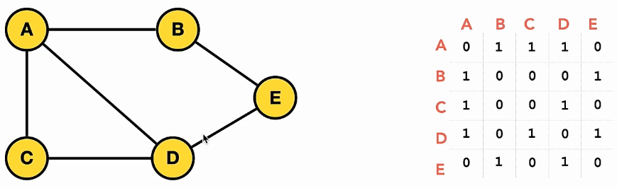
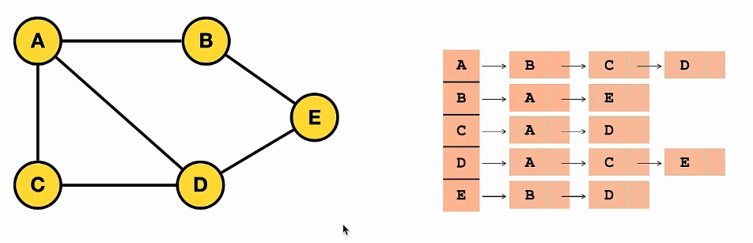
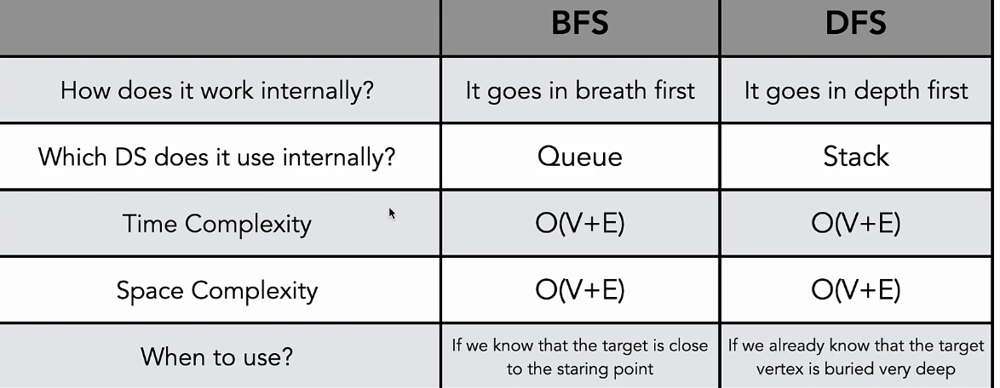

# Graph Data Structure 

- [Graph Data Structure](#graph-data-structure)
  - [Introduction](#introduction)
  - [Graph Representation](#graph-representation)
  - [Graph Traversal](#graph-traversal)
  - [Graph Algorithms](#graph-algorithms)

## Introduction

- graph -- non linear data structure 
  - nodes or vertices
  - edges or connections between pairs of vertices
  - unweighted graph
  - weighted graph
  - undirected graph
  - directed graph
  - cyclic graph 
  - acyclic graph
  - tree - special case of directed acyclic graphs
- networks, relationships
- only data structure that has cycle -- graph
- graph types 
  - directed
    - weighted
      - positive 
      - negative
    - unweigted
  - undirected
    - weighted 
      - positive
      - negative
    - unweighted


<br/><br/>

## Graph Representation 

- graph representation 
  - adjacency matrix -- 2d array
    - 
    - use when graph is complete, or almost complete 
  - adjacency list -- collection of unordered list 
    - 
    - use when edges are few

```py
# Adjacency List

from collections import deque 

class Graph: # O(e + v) SC
    def __init__(self):
        self.adjacency_list = {}

    def add_vertex(self, vertex): # O(1) TC 
        if vertex not in self.adjacency_list.keys(): # dictionaries in python are implemented as hashtables
            self.adjacency_list[vertex] = []
            return True
        return False

    def add_edge(self, vertex1, vertex2):
        if vertex1 in self.adjacency_list.keys() and vertex2 in self.adjacency_list.keys():
            self.adjacency_list[vertex1].append(vertex2)
            self.adjacency_list[vertex2].append(vertex1)
            return True
        return False

    def remove_edge(self, vertex1, vertex2):
        if vertex1 in self.adjacency_list.keys() and vertex2 in self.adjacency_list.keys():
            try:
                self.adjacency_list[vertex1].remove(vertex2)
                self.adjacency_list[vertex2].remove(vertex1)
            except ValueError:
                pass
            return True
        return False

    def remove_vertex(self, vertex):
        if vertex in self.adjacency_list.keys():
            if other_vertex in self.adjacency_list[vertex]:
                self.adjacency_list[other_vertex].remove(vertex)
            del self.adjacency_list[vertex]
            return True
        return False

    def bfs(self, vertex): # O(V+E) TC and O(V) SC -- visited set
        visited = set()
        visited.add(vertex)

        # queue = [vertex]
        queue = deque([vertex])

        while queue:
            current_vertex = queue.pop(0) # use deque from collections to get O(1) instead of O(n)
            current_vertex = queue.popleft()
            print(current_vertex)
            for adjacent_vertex in self.adjacency_list[current_vertex]:
                if adjacent_vertex not in visited:
                    visited.add(adjacent_vertex)
                    queue.append(adjacent_vertex)

    def dfs(self, vertex): # O(V+E) TC O(V) SC
        visited = set() # O(1)
        stack = [vertex]
        while stack: # O(v)
            current_vertex = stack.pop()
            if current_vertex not in visited:
                print(current_vertex)
                visited.add(current_vertex)

                for adjacent_vertex in self.adjacency_list[current_vertex]: # O(e)
                    if adjacent_vertex not in visited:
                        stack.append(adjacent_vertex)
                


new_graph = Graph()
new_graph.add_vertex('V')
new_graph.add_vertex('I')
new_graph.add_vertex('N')
new_graph.add_vertex('N')
new_graph.add_vertex('U')
new_graph.add_edge('V', 'U')
new_graph.add_edge('V', 'N')
new_graph.remove_edge('V', 'N')
new_graph.remove_vertex('I')
print(new_graph.adjacency_list)
```


```py
# Adjacency Matrix
class Graph:
    def __init__(self, num_vertices):
        self.num_vertices = num_vertices
        self.adjacency_matrix = [[0 for _ in range(num_vertices)] for _ in range(num_vertices)]

    def add_edge(self, vertex1_index, vertex2_index):
        if vertex1_index >= self.num_vertices or vertex2_index >= self.num_vertices:
            return False
        self.adjacency_matrix[vertex1_index][vertex2_index] = 1
        self.adjacency_matrix[vertex2_index][vertex1_index] = 1
        return True

    def remove_edge(self, vertex1_index, vertex2_index):
        if vertex1_index >= self.num_vertices or vertex2_index >= self.num_vertices:
            return False
        self.adjacency_matrix[vertex1_index][vertex2_index] = 0
        self.adjacency_matrix[vertex2_index][vertex1_index] = 0
        return True
     

new_graph = Graph(5)
new_graph.add_edge(0, 1)
new_graph.remove_edge(0, 1)
print(new_graph.adjacency_matrix)
```


<br/><br/>

## Graph Traversal 

- Breadth First Search - BFS
- start at arbitrary node, and explore the neighbor nodes first before moving to next level 
```py
def bfs(self, vertex):
    visited = set()
    visited.add(vertex)

    queue = [vertex]
    while queue:
        current_vertex = queue.pop(0)
        print(current_vertex)
        for adjacent_vertex in self.adjacency_list[current_vertex]:
            if adjacent_vertex not in visited: 
                visited.add(adjacent_vertex)
                queue.append( adjacent_vertex)
```


<br/><br/>

- Depth First Search - DFS
- start at arbitrary ndoe, go as deep as you can, and then backtrack
```py
def dfs(self, vertex):
    visited = set()
    stack = [vertex]

    while stack:
        current_vertex = stack.pop()
        if current_vertex not in visited:
            print(current_vertex)
            visited.add(current_vertex)
        for adjacency_vertex in self.adjacency_list[current_vertex]:
            if adjacent_vertex not in visited: 
                stack.append(adjacent_vertex)
        
```

- 


## Graph Algorithms 

- Topological Sort
- 